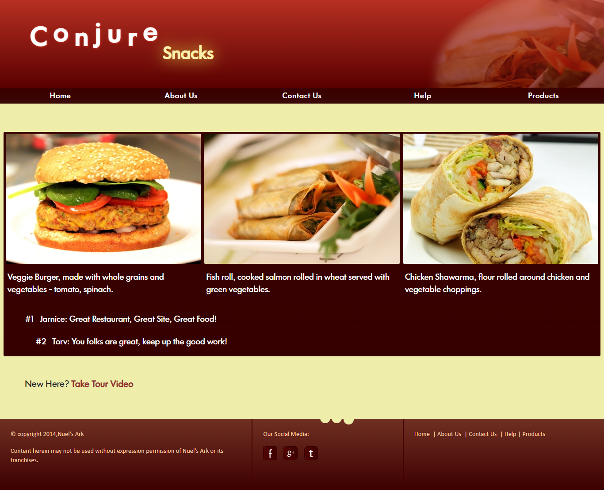
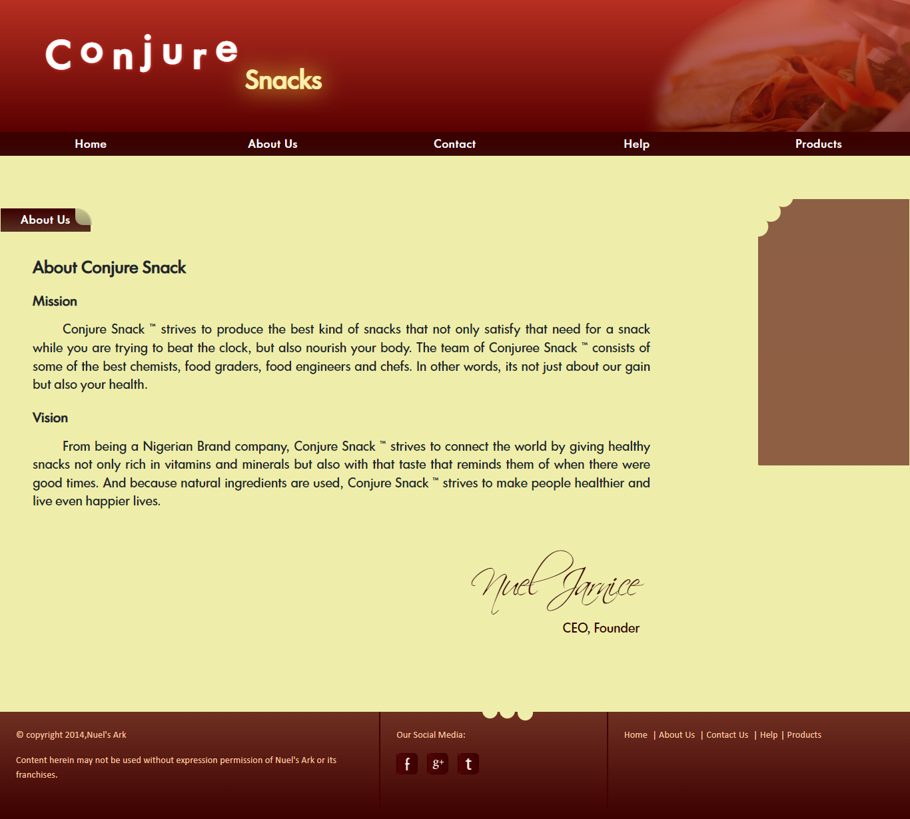
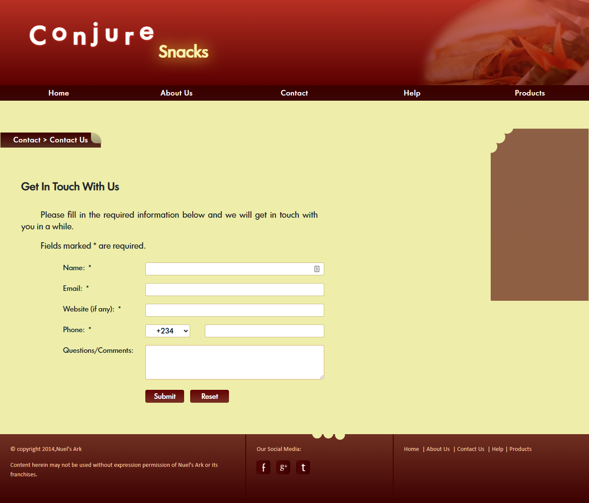
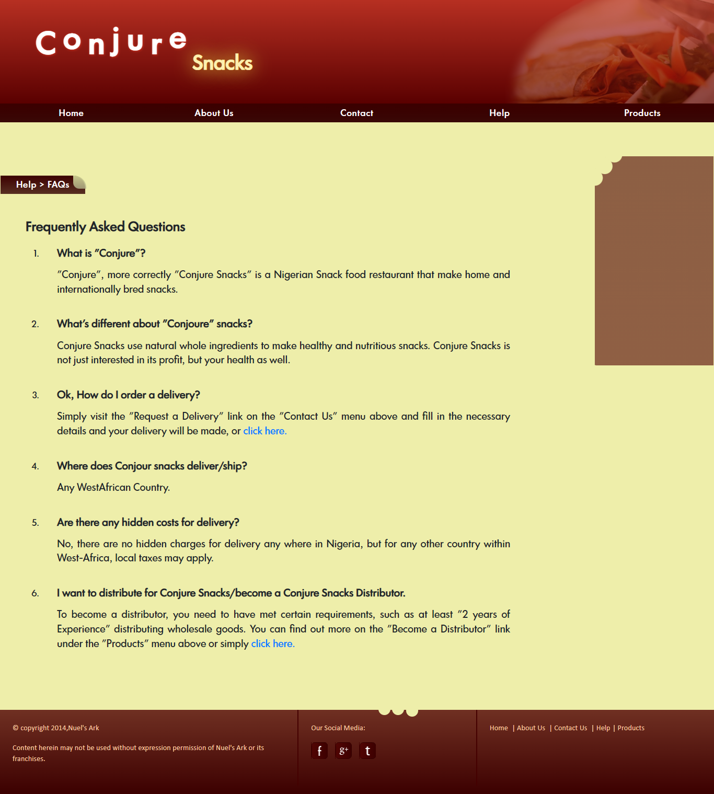

# Conjour Snack Website Template

A snack bar themed HTML website template I made for an assignment during a program at an IT institution (while home during a school, erm, pause) a while back before I learnt frameworks (and CSS variables). It can also work for any food-themed website with a bit of effort. This template was midwifed by ideas from 2 other mini-projects (a classwork from same program and another home project where I experimented with markup and styling), both of which I no longer have.

It won't be maintained by me going forward.

There are no CSS variables, but you can fork this project and extract them to make retheming easier or rewrite parts of the website into components for any of the modern frameworks.

You may also create a theme out of it for your favourite CMS or use it (in part or whole) directly in your own projects if you wish.

> **_Conjure:_** Summon into action or bring into existence, often as if by magic.

I misspelt (not deliberately) the project several times as "Conjour" because of its similarity to the French greeting "Bonjour" (though they sound differently when spoken).

Star or use as you see fit. Thank you.

## Home Page

### Pages:

Contains the following pages (.html):

- index
- about
- contact
- thankYou
- products
- requestDelivery
- faq
- review
- tour (with a video demonstration on how to get around the site)

### Media:

A tour video `TourVideo.mp4` that demonstrates how to use the site in the `./videos` folder with fallback formats in ogg, webm, wmv, swf and flv formats (Did I mention this site was from a while ago?).

## Some of the other pages

About Page

Contact Page

FAQ Page
